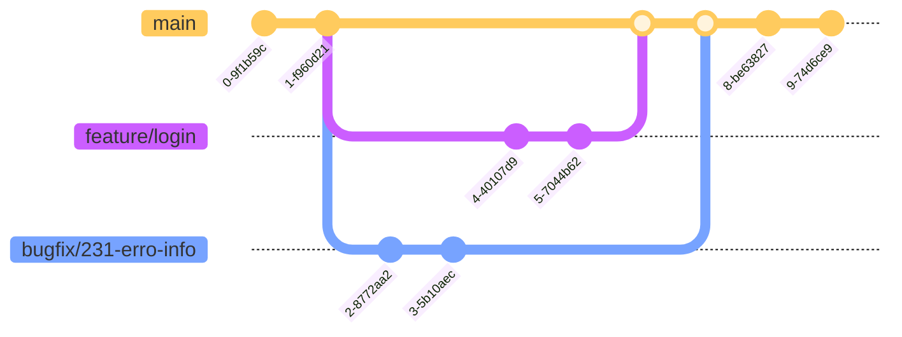

# Fluxo de trabalho

Neste módulo abordaremos o fluxo de trabalho da equipe e o uso do GIT como ferramenta de versionamento de código de forma a orquestrar de forma harmoonica o trabalho de desenvolvimento colaborativo a ser conduzido durante o processo de desenvolvimento dos códigos.  

O *GitHub Flow* é um modelo de fluxo de trabalho leve e flexível que se baseia no uso de branches (ramificações) no Git e é particularmente adequado para projetos com ciclos de desenvolvimento rápidos. Aqui estão os passos básicos do GitHub Flow:

1. **Criação de uma Branch:**

    - Comece criando uma nova branch (ramificação) no repositório para cada nova funcionalidade, correção de bug ou tarefa que você estiver trabalhando. Geralmente, as branches são nomeadas de maneira descritiva.

        ```bash
        git checkout -b nome-da-minha-feature
        ```

1. **Commits Incrementais:**

    - Faça commits incrementais enquanto trabalha na sua branch. Cada commit deve representar um passo lógico no desenvolvimento da funcionalidade ou correção.

        ```bash
        git commit -am "Mensagem descritiva do commit"
        ```

2. **Abertura de Pull Request:**

    - Assim que concluir o desenvolvimento na sua branch, abra um Pull Request (PR). Isso permite que os responsáveis(pares) revisem suas alterações antes de serem mescladas na branch principal (normalmente main ou master). 

3. **Revisão de Código (Code Review):**

    - Membros da equipe revisam seu código no Pull Request. Durante a revisão, podem ser feitos comentários, sugestões ou alterações adicionais podem ser solicitadas.

4. **Integração Contínua:**

    - Utilize sistemas de integração contínua (CI) para garantir que as alterações propostas não quebrem o build e passem nos testes automaticamente.

5. **Merge na Branch Principal:**

    - Após a revisão e a aprovação do Pull Request, a branch pode ser mesclada na branch principal. Isso pode ser feito pelo próprio autor do Pull Request ou por outro membro da equipe.

6. **Deploy:**

    - Se houver um ambiente de produção, realize o deploy das alterações após a mesclagem na branch principal.

7. **Exclusão da Branch:**

    - Após a mesclagem e o deploy bem-sucedido, a branch pode ser excluída, pois seu propósito foi cumprido.

Esse fluxo é cíclico e se repete para cada nova funcionalidade ou correção de bug, mantendo um histórico claro das alterações e permitindo que a equipe colabore de maneira eficiente. Vale ressaltar que o *GitHub Flow* é uma abordagem mais simplificada em comparação com outros modelos mais complexos, como *Gitflow*.

## Branches

Linha principal (tronco) de desenvolvimento. Esta é a única branch permanente e deve ter acesso controlado.

Branches de curta duração que são usadas para trabalhar em todas as partes do sistema. Estas são deixadas a critério do usuário, mas alguns exemplos típicos seriam:

    - feature/descricao-curta-feature 
    - bugfix/1234-descricao (o número corresponde ao id do issue)
    - hotfix/1234-descricao

* **Atenção:** A diferença entre bugfix e hotfix é que o segundo corrige erros em produção e o primeiro só no desenvolvimento


## Tag

As etiquetas (tags) são usadas para acionar eventos dentro do fluxo. O uso das tags será feito no lançamento de um *relase candidate*, ou seja, de um fechamento de versão e terá o seguinte padrão:

`x.y.z`

Onde:

    - x - versão principal: terá o número incrementado uma vez que tenha sido instalado a versão anterior com os requisitos fechados em produção com garantia de funcionalidades operacionais.

    - y - versão secundária: terá o número incrementado nas várias sprints de projetos.

    - z - versão de correção: terá o número incrementado nas correções de erros de uma mesma sprint.

A regra é no incremento do número hierarquicamente superior (ou à esquerda), zera-se os inferiores (ou à direita).

Todos os artefatos gerados a partir do build da versão com a tag terá esse número de versão como referencia e deverá passar por todos os ambientes de implantação, ou seja, homologação e produção.  Um release candidate pode ter seu ciclo de implantação interrompido.

## Tipo de repositório

Será utilizado um repositório do tipo monorepo, ou seja, a compatibilidade sempre será mantida entre front e back que será desenvolvido ao mesmo tempo com todas as features sendo implementadas na mesma sprint no backend e no frontend.  Essa decisão se baseia nas seguintes premissas:

Gerenciamento de Dependências Simplificado:

- Consistência de Versões
- Refatoração e Mudanças Globais
- Compartilhamento de Código Facilitado
- Melhor Rastreamento de Alterações e Histórico
- Build e Teste Mais Eficientes
- Padronização de Ferramentas e Configurações
- Facilidade na Navegação e Descoberta
- Simplificação do Versionamento

## Exemplo de fluxos de trabalho

Vamos expor os tipos de uso dos branchs.  A branch main sempre terá a última versão com todas as features.

### Novas features

Para novas features ou bugfix utilizamos uma branch seguindo o padrão de nomenclatura. O exemplo abaixo considera 2 implementações sendo desenvolvidas, uma feature e um bugfix.



### Hotfix features

No exemplo abaixo mostra a aplicação de um hotfix (versão 1.0.1) e após isso a aplicação de um novo hotfix (versão 1.0.2).


